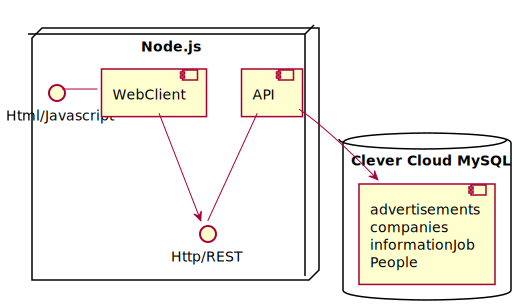
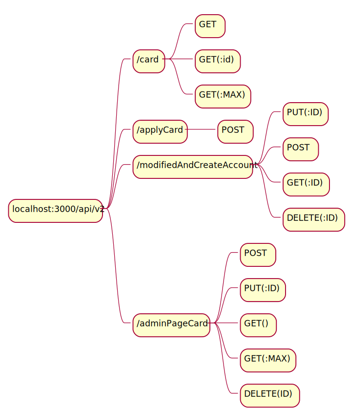
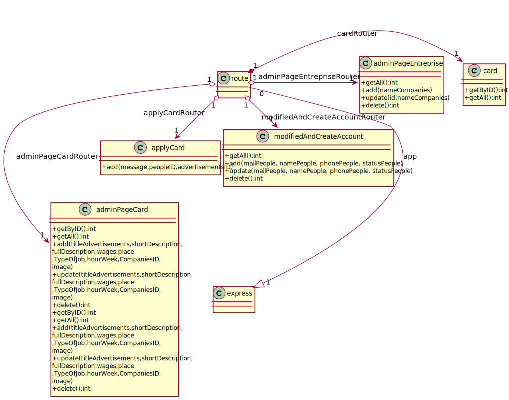

[](https://travis-ci.org/badges/badgerbadgerbadger)
[](https://coveralls.io/r/badges/badgerbadgerbadger)
[](https://www.gnu.org/licenses/gpl-3.0)
[](https://github.com/ellerbrock/open-source-badges/)


# Official bande organisée dashboard
<p align="center"><a target="_blank" rel="noopener noreferrer" href="https://camo.githubusercontent.com/06b2f979b4fbab8f1822cab69783700f0afa1f90/68747470733a2f2f6e7578746a732e6f72672f6d6574615f3430302e706e67"></a></p>
---

> This repo is a project created of job b0ard create with Tharick during the 3eme year at Ep1tech.
  https://github.com/TharickABDUL


- This projet have take 3 weeks.

> To test the API i preconise to use postman for HTTP request.

---



## Project setup
### Compiles and hot-reloads for development with nodemon

```
# Install dependecies & for the api

# serve with hot reload at localhost:8000
npm run dev

# api at localhost:4000
npm run start

```


---

## Routes of the API



---
## Structure of the API
### Class diagram




## Front end


